# React Interview

## 1. Create an empty react project?

    • Create React App using npx create-react-app my-app

    • Start Development Server using npm start

## 2. What are the different ways in which we can create a react project?

    • Next.js npx create-next-app@latest my-app

    • Vite npm create vite@latest my-app

    • Remix npx create-remix@latest my-app

## 3. Why Vanilla Javascript is replaced by React?

    • Using vanilla javascript we can hide DOM element when a button clicked.
        However it’s more complex to query and update the DOM element.

    • In react we can create and modify the component.
        Less code developer can understand and easy to maintainable.

## 4. What is a component tree?

    • The component tree is structure of DOM element.
        React start root and render all child  components.

    • It helps to find debugging errors, performance optimization and easy to test the application.

## 5. What is the difference between App.jsx and index.jsx?

    • App.jsx is the root component and it render entire application.

    • index.jsx is a starting point of the application and it will wrap the application content and
        it will use to separating application layout.

## 6. What is the difference between file extension jsx and js?

    • JSX, It allow us to write HTML in Javascript.

    • JS, It contains only javascript code.

## 7. What is JSX?

    • JavaScript XML, It allow us to write HTML in Javascript.

## 8. How to access javascript code inside JSX?

    • Anything written inside curly braces { } react considered as javascript code.

## 9. How react renders a component?

    • React start root component and render all child components.

    • React renders structure of place the HTML DOM element.

## 10. What is Virtual DOM?

    • The light weight copy of real DOM.

    • Virtual DOM keep tracking of UI changes and before updating compared both DOM.

## 11. What is real DOM?

    • DOM is a structure of HTML element.

    • Using javascript to manipulate CRUD operations in DOM nodes.

## 12. React vs React-DOM library?

    • React is core libraries and it will use to create react components.

    • React DOM is companion library and it will use to create DOM nodes,
        keep DOM Synchronization and Handling events.

## 13. What is Functional Component?

    • It’s Java Script functions return react element.

    • Code Reusable, Stateless and easy to understand.

## 14. Write an example component code with JSX which includes a small javascript code?

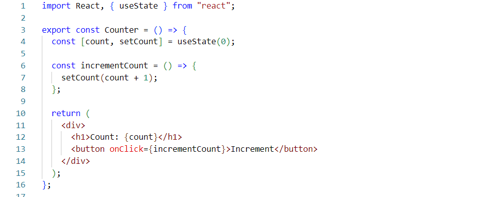

## 15. Using bootstrap create a list group component which lists the different items in an array?

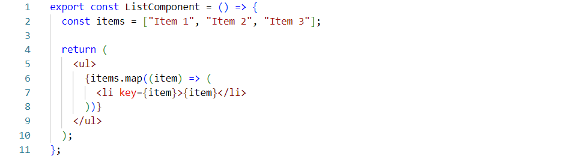

## 16. Why we need a key property while rendering a list?

    • Improve the performance of CURD operation. Track the Identity of the particular item in list,
         It will helps to identifying errors for debugging.

## 17. What is fragment?

    • Special element it will help to group the elements without adding extra DOM node.

## 18. Why we need fragment?

    • To avoid unnecessary DOM nodes, Improve code readability and maintainability
        and create reusable components.

## 19. What is conditional rendering?

    • Displaying content based on certain conditions, it will helps to create dynamic user interface.

## 20. What is an event handler? Write a simple event handling code.

    • HTML DOM events like Click, Change, Mouse Over and etc.

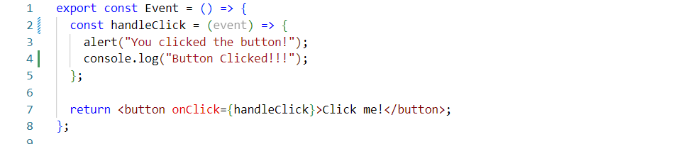

## 21. What is ‘event’ argument of event handler?

    • The Event argument is used to trigger the action based event handler in react.

## 22. What is Props? And give an example program for it.

    • Props are arguments passed into React components via HTML attributes and
        also pass immutable data from parent to child components.

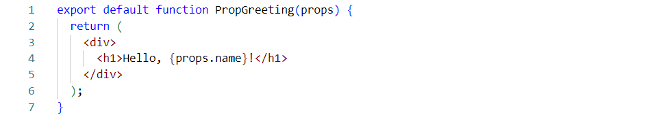

## 23. How to pass a function as a props?

    • Define function component as a parent and pass it to child component as a prop.

## 24. What is state? Show an example.

    • State is changes and re-render of the components.

    • this.state property is used to update the state in class component.

    • In functional component using useState Hook to returns current and update state.

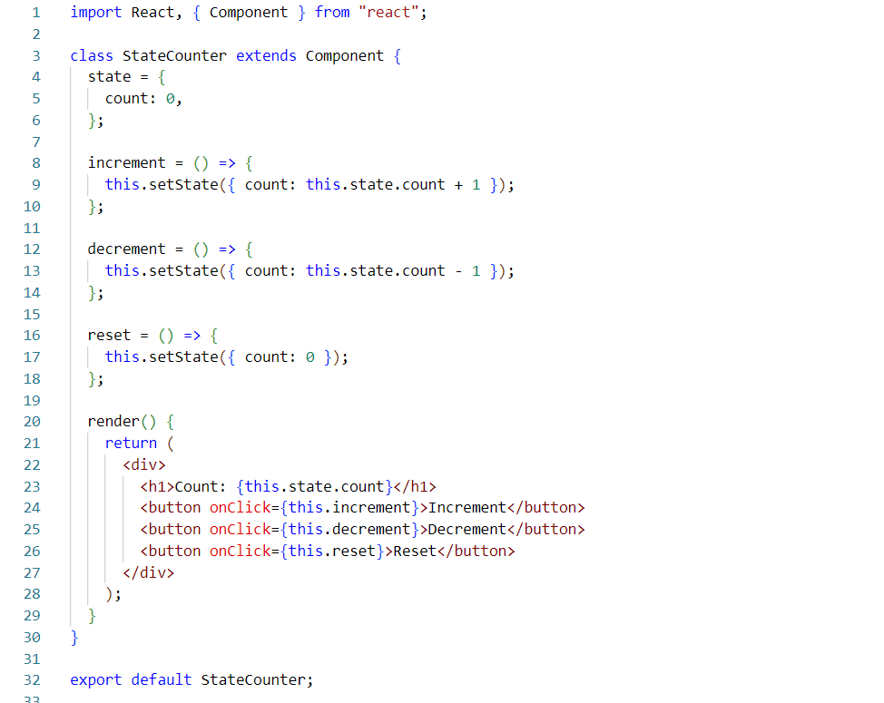

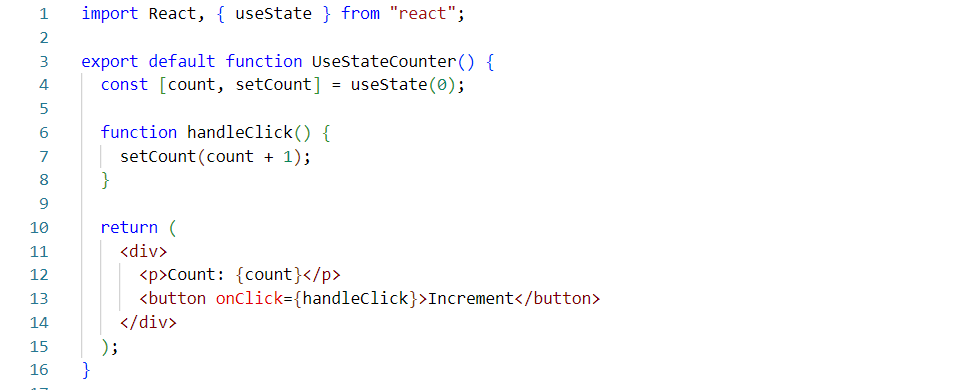

## 25. State Vs local variable?

    • State will change and re-render the components.

    • Local variable will change but not re-render the components.

## 26. State Vs props?

    • State is managed by component itself

    • Props are managed by parent component.

## 27. What does children props means? Give an example for it.

    • Children props are used to render content within components.

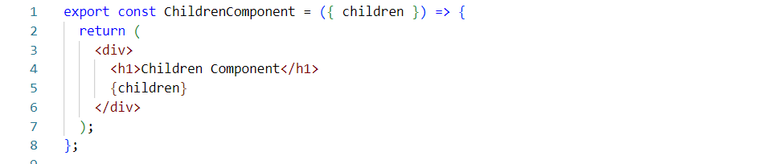

## 28. What is pure component?

    • The pure component depend on state and props, always returns same input and output.

    • Improve performance, Skip re-rendering, Reduce bugs and Maintain the code easier.

## 29. What is Strict Mode in React?

    • StrictMode is a tool for highlighting potential problems in an application.

## 30. Create an object using useState and update it.

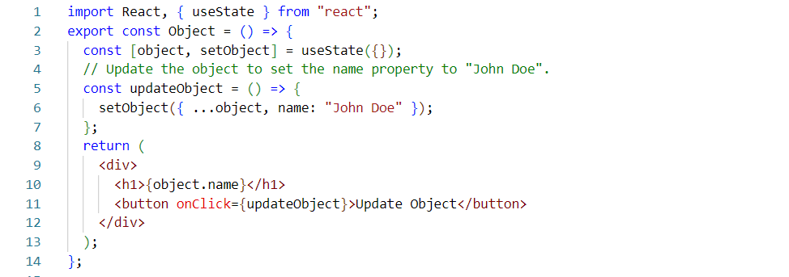

## 31. Create a nested object using useState and update it.

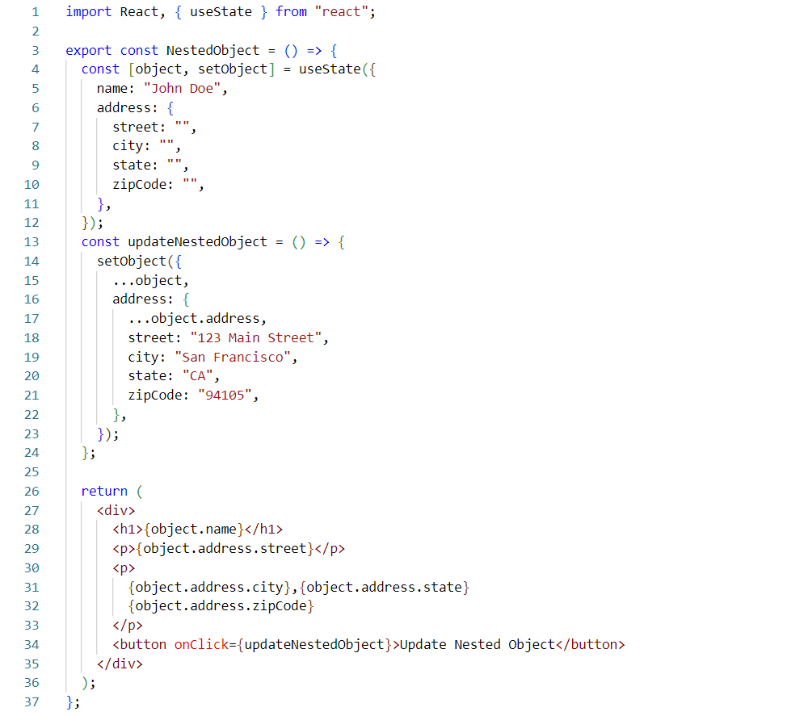

## 32. Create an array using useState and update it.

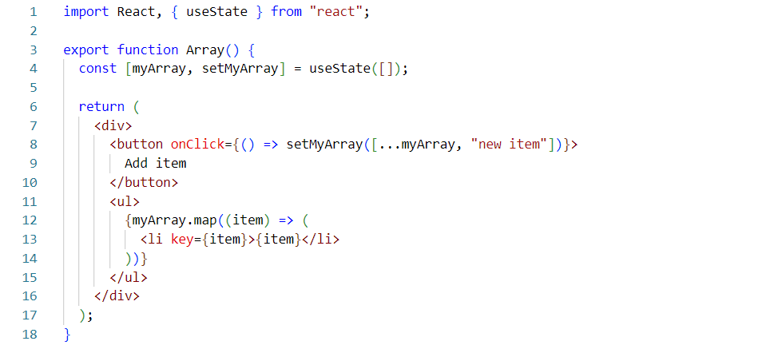

## 33. Create an array of objects using useState and update it.

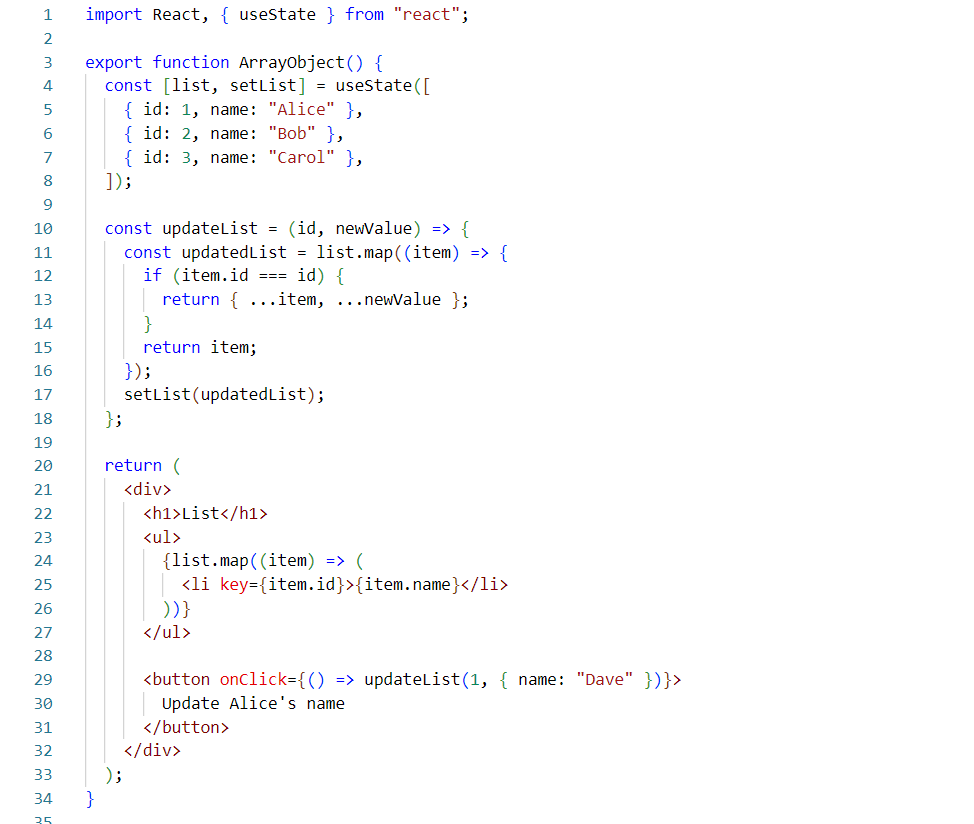

## 34. What is Immer? Show an example.

    • The immer is data structure library. It will use to simplify the state management
        and improve performance.

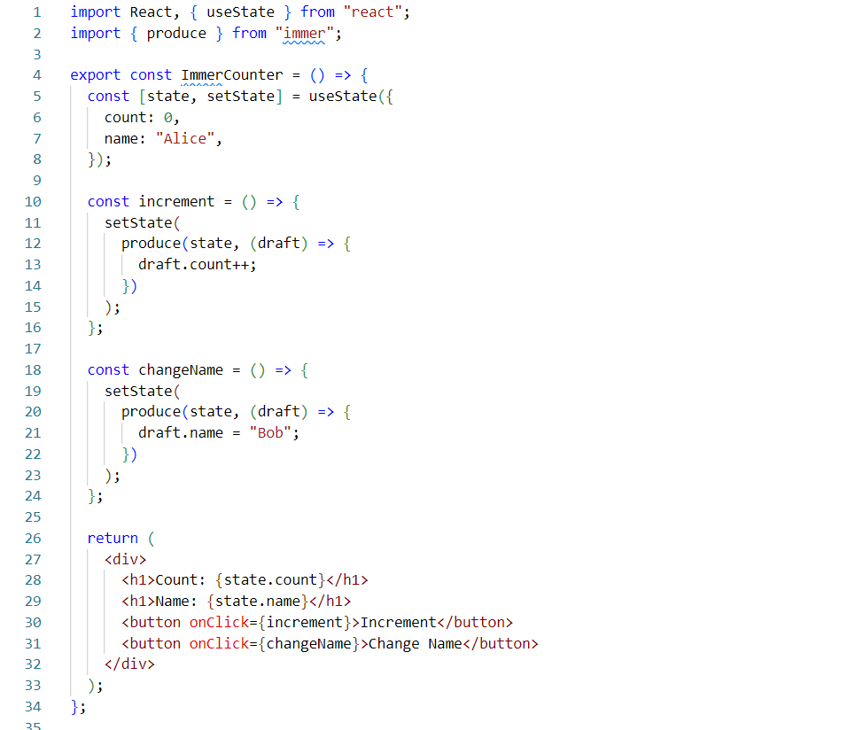

## 35. How do you share state between components? An example for it.

    • Using props and state management libraries like context and redux.

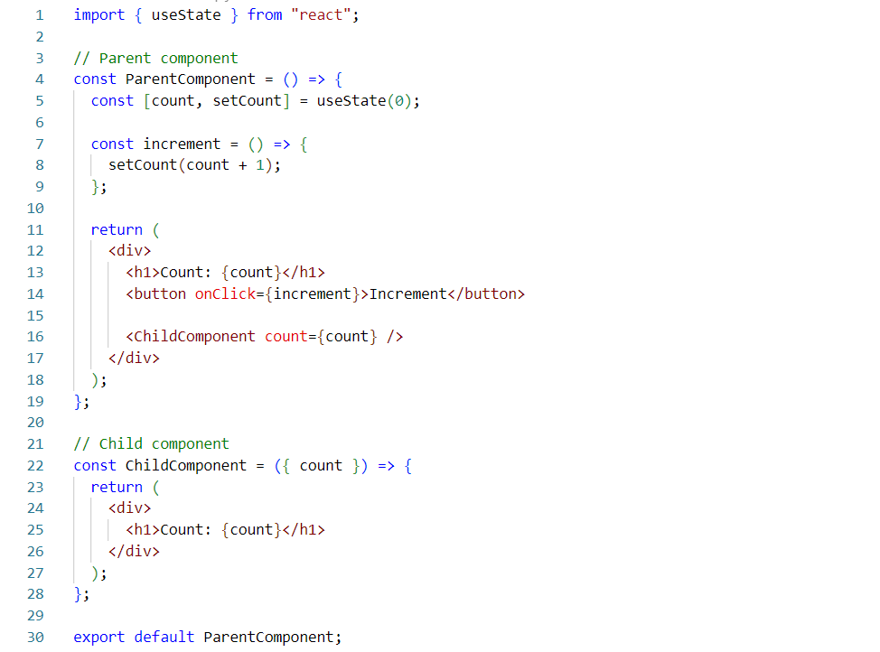

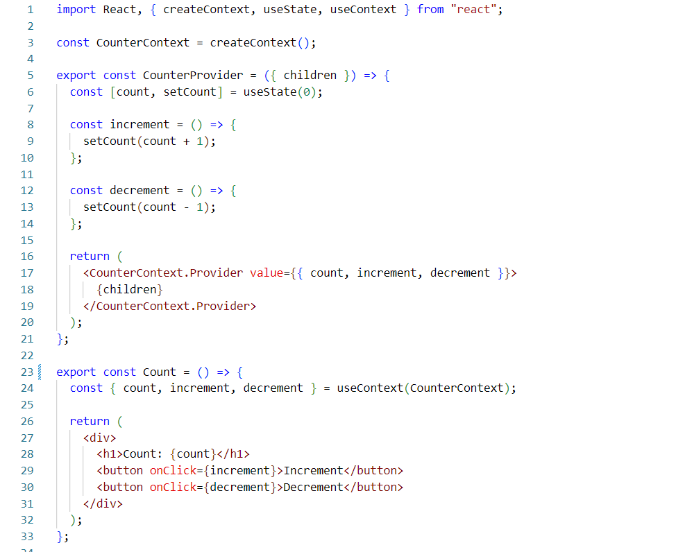

## 36. Create a Form and show an example for it?

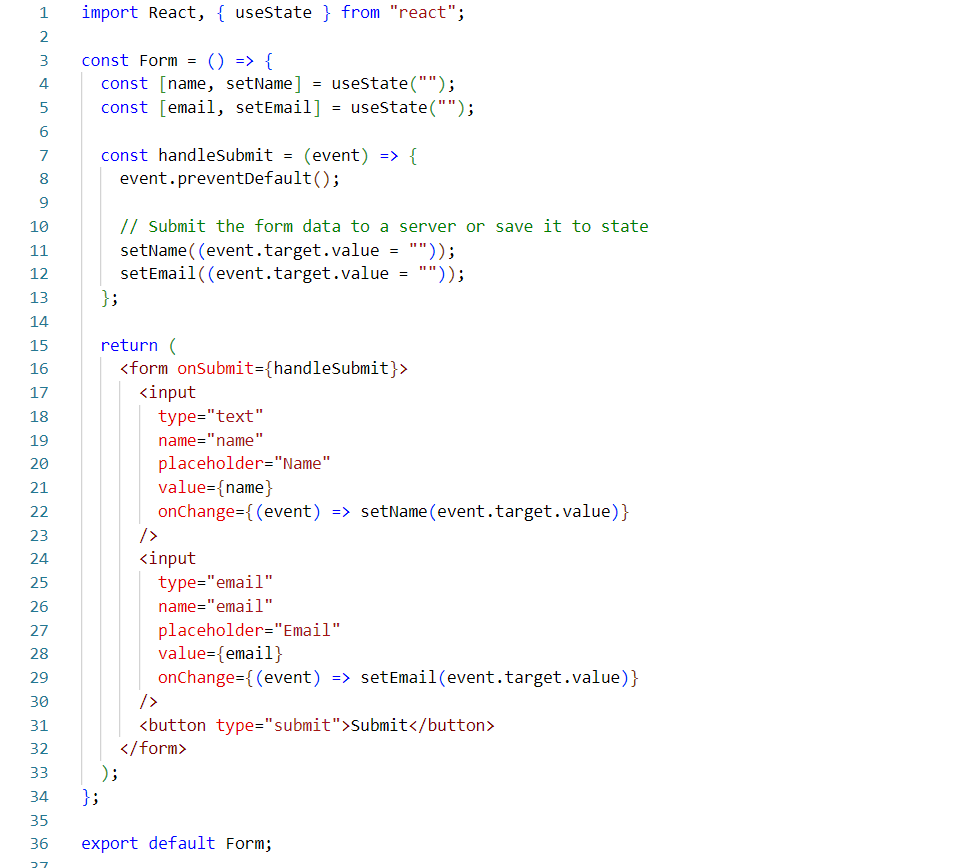

## 37. In Form’s what is the difference between useState and useRef?

    • useState is re-render when updated state changes, But useRef skipped the re-render.

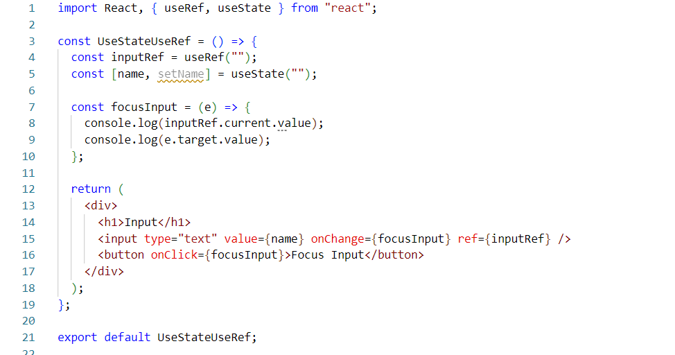

## 38. What is React-Hook-Form? Example?

    • React-Hook-Form is a complex form management library.

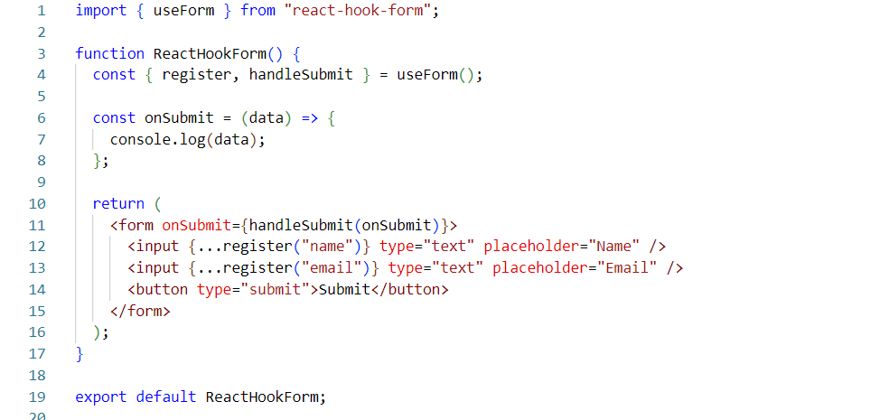

## 39. What is Zod? Example?

    • Zod is a schema validation library.

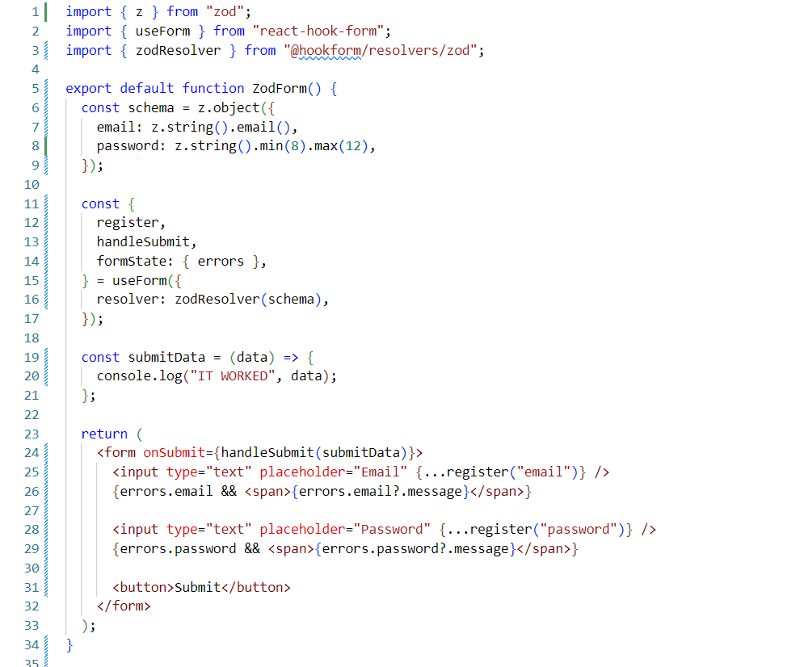

## 40. What is useEffect?

    • useEffect perform side effect of the components like fetching data, updating DOM and timers.

    • useEffect accepts two arguments useEffect( <function> , <dependency> ).

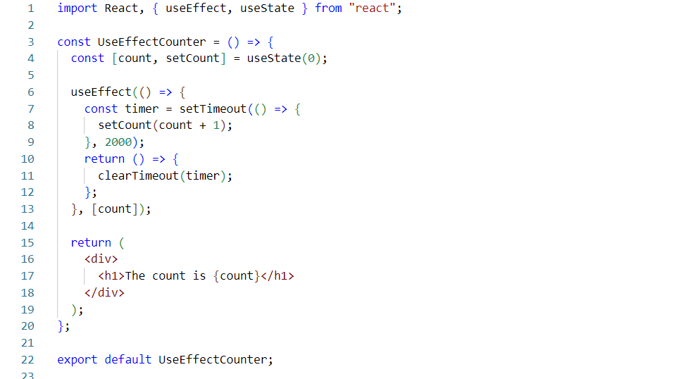

## 41. What is dependency array in useEffect?

    • The dependency array in useEffect is a list of values that,
        if they change, will cause the useEffect function to run again.
